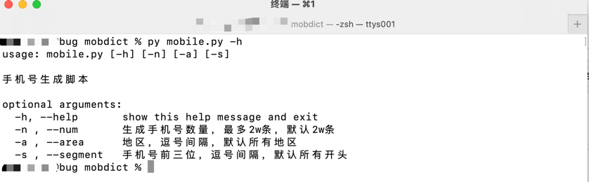
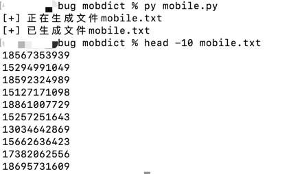
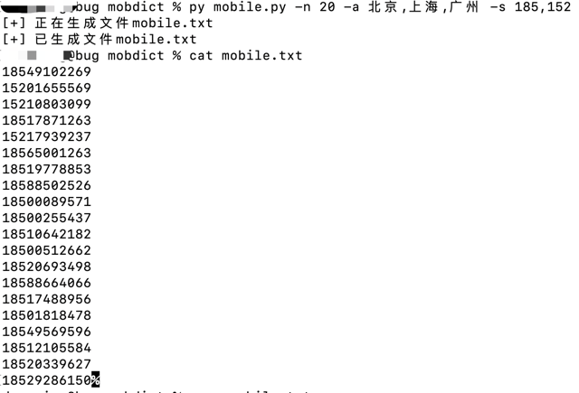

# mobdict
手机号随机生成多条，可以根据地区、手机号开头前三位来生成（地区和手机号前三位可看文件mobdict.xlsx）。
# 使用方法
```py mobile.py -h```

执行完可以查看，一些相应参数内容，过程中出现的+、-和*分别代表正常运行、数据存在问题和请求异常正常运行完毕会生成mobile.txt文件



```py mobile.py```

生成2w条，随机地区且随机开头前三位手机号



```py mobile.py -n 20 -a 北京,上海,广州 -s 185,152```

生成20条，北京、上海和广州地区且手机号开头为185、152的手机号



$\color{red}{注：地区和手机号间隔逗号为英文逗号}$ 
